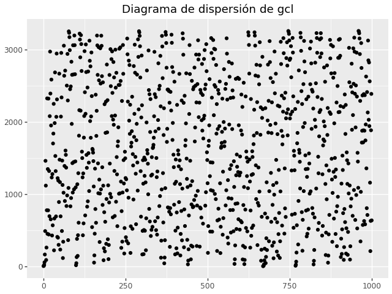
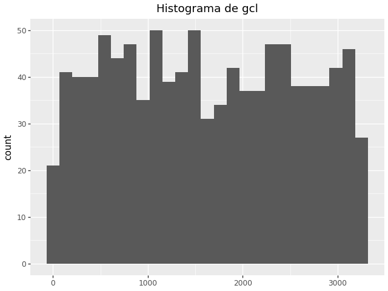
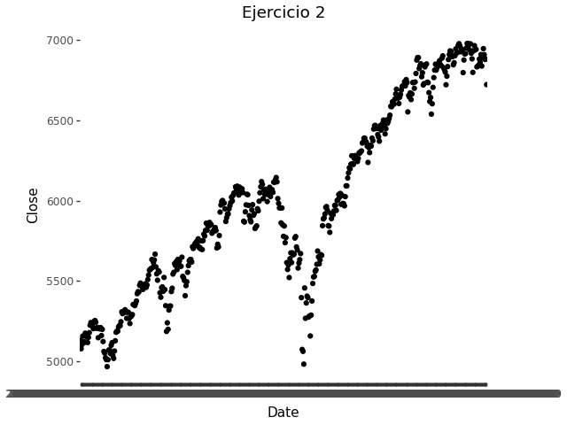
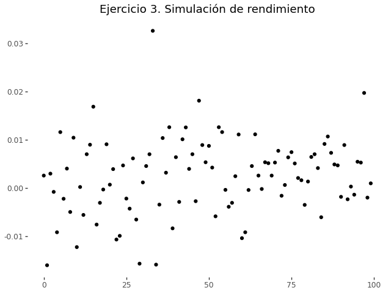

# Tarea-examen 1
## Simulación estocástica

Lenin Pavón Alvarez

En este repositorio se encuentra el código para reproducir los resultados de los tres problemas de la tarea-examen 1 de simulación estocástica

# Instalación

Se requiere hacer uso de [uv](https://docs.astral.sh/uv/) para manejar la paquetería del proyecto. Se puede instalar uv con su instalador:

```shell
curl -LsSf https://astral.sh/uv/install.sh | sh
```

o también se puede descargar directamente desde pip

```shell
pip install uv
```

Al momento de ejecutar el código por primera vez se creará un entorno con las dependencias en `pyproject.toml` utilizando las fuentes del `uv.lock`. 

# Uso del código
Posterior a la instalación de uv, se pueden ejecutar los scripts de Python (como `main.py`) de la siguiente manera:

```shell
uv run main.py
```

En `main.py` se encuentra el código necesario para reproducir los resultados discutidos en la tarea.

## Organización del código

- `data/`: directorio donde se encuentran los datos usados para el problema 2 y 3
- `data.py: Script de Python que permite la descarga y lectura usando la API de Yahoo Finance, por defecto obtiene los datos del SP500
- `gcl.py`: Script de Python que contiene el código para generar un generador congruencial lineal de números psudoaleatorios, junto con un par de algoritmos de teoría de números.
- `ks.py`: Script de Python que contiene la función para generar el estadístico de Kolmogorov-Smirnof
- `unif.py`: Script de Python que contiene el código para la construicción de la función de distribución empírica (`construir_empirica`) y la función de inversa generalizada (`construir_inversa_generalizada`)

# Resultados
## Problema 1




Prima facia se ve uniforme si sólo se inspecciona los gráficos de dispersiones. No parece haber una dependencia a los términos anteriores y estar repartido de forma uniforme a lo largo del codominio. Sin embargo, el histograma nos hace ver que hay cierta tendencia de aglomeración en ciertos cuantiles por sobre otro; por lo que aunque parece uniforme podríamos utilizar un periodo más grande para intentar igualar la distribución de las simulaciones.

## Problema 2



Rechazamos la hipótesis nula (que es que ambas distribuciones se distribuyen de la misma manera) para los precios de la columna _Close_ debido al bajo valor del p-value.

## Problema 3



Usando como semilla `3259`, tomando el último precio de _Close_ y el último rendimiento simulado, se simula el precio del día posterior como `6728.774`

| Close          | Rendimiento simulado  | Precio simulado |
| -------------- | --------------------- | --------------- |
| 6722.259765625 | 0.0009690634297987444 | 6728.7740       |

